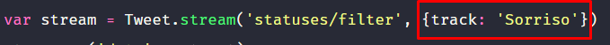

# SorrisoBot

## Imports Utilizados para o Bot

* [TwitterAPI](https://www.npmjs.com/package/twitter)
* [Dotenv](https://www.npmjs.com/package/dotenv)

## Como utilizar o código para escolher sua palavra

* ### Troque no código o "track: 'Sorriso" para "track: '[sua palavra]'
* ### Exemplo: 

    

## Iniciar o Bot: 
  No terminal e dentro da pasta root, digite:
```
  yarn start
```
